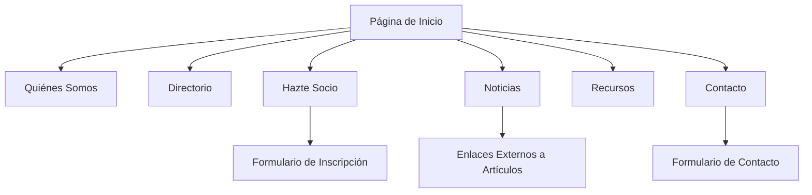

# Documento de Requerimientos del Producto

## Sitio Web Asociación Gremial de Técnicos Jurídicos y Afines de Chile A.G.

## 1. Descripción General del Producto

Sitio web institucional profesional para la Asociación Gremial de Técnicos Jurídicos y Afines de Chile A.G., una entidad con 20 años de historia que representa y defiende los derechos de los técnicos jurídicos del país. El sitio debe proyectar profesionalismo, confianza y autoridad en el ámbito legal, siendo completamente responsivo para todos los dispositivos.

* **Objetivo principal**: Establecer presencia digital profesional, facilitar la afiliación de nuevos miembros y mantener informada a la comunidad de técnicos jurídicos.

* **Público objetivo**: Técnicos jurídicos, profesionales del derecho, estudiantes de carreras afines y público general interesado en servicios legales.

* **Valor del mercado**: Fortalecer la imagen institucional y facilitar el crecimiento de la membresía de la asociación.

## 2. Características Principales

### 2.1 Roles de Usuario

| Rol                 | Método de Acceso                | Permisos Principales                                             |
| ------------------- | ------------------------------- | ---------------------------------------------------------------- |
| Visitante General   | Acceso directo al sitio         | Puede navegar por información pública, leer noticias y contactar |
| Miembro Potencial   | Formulario de inscripción       | Puede solicitar membresía y acceder a información de beneficios  |
| Usuario por Defecto | Acceso básico sin autenticación | Puede utilizar todas las funcionalidades públicas del sitio      |

### 2.2 Módulo de Características

Nuestro sitio web institucional consta de las siguientes páginas principales:

1. **Página de Inicio**: banner hero con imagen profesional, sección de bienvenida, llamada a la acción para afiliación, sección de noticias destacadas
2. **Quiénes Somos**: historia de la asociación, misión y visión, información institucional
3. **Directorio**: presentación del directorio vigente y saliente con fotografías y cargos
4. **Hazte Socio**: formulario de inscripción, beneficios de la membresía, requisitos
5. **Noticias**: listado de artículos y comunicados de prensa con enlaces externos
6. **Recursos**: biblioteca digital con documentos y análisis legales
7. **Contacto**: información de contacto y formulario de consultas

### 2.3 Detalles de Páginas

| Nombre de Página | Nombre del Módulo      | Descripción de Características                                                                                                                                                                          |
| ---------------- | ---------------------- | ------------------------------------------------------------------------------------------------------------------------------------------------------------------------------------------------------- |
| Página de Inicio | Banner Hero            | Mostrar imagen profesional de fondo con título "Asociación Gremial de Técnicos Jurídicos y Afines de Chile A.G." y lema "20 años construyendo el futuro y la dignidad de la profesión técnico-jurídica" |
| Página de Inicio | Sección Bienvenida     | Presentar texto "Somos la voz de los Técnicos Jurídicos de Chile" con descripción institucional y botón prominente "Únete a la Asociación"                                                              |
| Página de Inicio | Noticias Destacadas    | Mostrar 3 noticias principales con títulos y enlaces a artículos externos                                                                                                                               |
| Quiénes Somos    | Historia Institucional | Presentar información sobre 20 años de historia, registro oficial N° 3610, misión y visión de la asociación                                                                                             |
| Directorio       | Directorio Vigente     | Mostrar equipo directivo 2025-2028 con nombres, cargos y fotografías profesionales                                                                                                                      |
| Directorio       | Directorio Saliente    | Presentar directorio anterior 2022-2025 con agradecimientos por la gestión                                                                                                                              |
| Hazte Socio      | Formulario Inscripción | Crear formulario con campos: nombre, RUT, email, teléfono, institución, año titulación, adjuntar certificado                                                                                            |
| Hazte Socio      | Beneficios Membresía   | Listar representación gremial, capacitación, networking, recursos exclusivos, bolsa de trabajo                                                                                                          |
| Noticias         | Listado Artículos      | Mostrar artículos con títulos, resúmenes y enlaces externos a medios de prensa                                                                                                                          |
| Recursos         | Biblioteca Digital     | Presentar documentos descargables, algunos públicos y otros exclusivos para socios                                                                                                                      |
| Contacto         | Información Contacto   | Mostrar email <contacto@juridicosag.cl>, teléfono y dirección (pendiente del cliente)                                                                                                                   |
| Contacto         | Formulario Consultas   | Crear formulario simple con nombre, email, asunto y mensaje                                                                                                                                             |

## 3. Proceso Principal

**Flujo Principal del Usuario:**
El visitante ingresa al sitio web y es recibido por un banner hero profesional que establece inmediatamente la credibilidad de la asociación. Puede navegar por las diferentes secciones para conocer la historia, el directorio actual, leer noticias relevantes y acceder a recursos. Si está interesado en afiliarse, puede completar el formulario de inscripción con sus datos y certificado de título. Para consultas generales, puede utilizar el formulario de contacto.

## 4. Diseño de Interfaz de Usuario

### 4.1 Estilo de Diseño

* **Colores primarios**: Azul marino (#1a365d) y dorado/bronce (#b8860b) para transmitir profesionalismo y prestigio legal

* **Colores secundarios**: Gris claro (#f7fafc) para fondos y blanco (#ffffff) para contenido

* **Estilo de botones**: Botones rectangulares con bordes suaves, efecto hover sutil

* **Tipografía**: Fuente serif elegante para títulos (como Playfair Display) y sans-serif para texto (como Inter), tamaños 16px-18px para lectura

* **Estilo de layout**: Diseño limpio con mucho espacio en blanco, navegación superior fija, secciones bien definidas

* **Iconos**: SVG minimalistas en estilo outline, relacionados con justicia y profesionalismo

### 4.2 Resumen de Diseño de Páginas

| Nombre de Página | Nombre del Módulo | Elementos de UI                                                                                       |
| ---------------- | ----------------- | ----------------------------------------------------------------------------------------------------- |
| Página de Inicio | Banner Hero       | Imagen de fondo con overlay oscuro, tipografía serif grande en blanco, botón CTA prominente en dorado |
| Página de Inicio | Navegación        | Header fijo con logo, menú horizontal, colores azul marino sobre fondo blanco                         |
| Quiénes Somos    | Sección Historia  | Layout de dos columnas con texto e imagen de la estatua de la justicia, tipografía elegante           |
| Directorio       | Tarjetas Miembros | Grid responsivo con fotografías circulares, nombres en serif, cargos en sans-serif                    |
| Hazte Socio      | Formulario        | Campos con bordes suaves, labels flotantes, botón de envío destacado en dorado                        |
| Noticias         | Cards Artículos   | Tarjetas con sombra sutil, imágenes destacadas, títulos en serif, fechas en gris                      |
| Recursos         | Lista Documentos  | Iconos SVG de documentos, enlaces con hover effect, indicadores de acceso público/privado             |
| Contacto         | Información       | Layout centrado con iconos SVG, información de contacto clara y formulario integrado                  |

### 4.3 Responsividad

El sitio está diseñado con enfoque mobile-first, adaptándose perfectamente a:

* **Móviles** (320px-768px): Navegación hamburguesa, contenido apilado verticalmente

* **Tablets** (768px-1024px): Layout híbrido con algunas secciones en dos columnas

* **Laptops** (1024px-1440px): Diseño completo con todas las características

* **Desktop grande** (1440px+): Contenido cent

